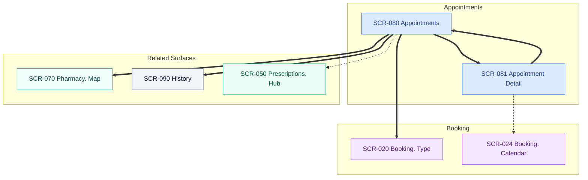

# Information Architecture (IA Map)

Canonical rules: `docs/artifacts/visual-artifacts-rules.md`

**Created:** 2026-01-21  
**Last Updated:** 2026-01-21  
**Source of Truth:** `client/src/App.tsx` routes, plus in-page navigation via `useLocation()` and `<Link />`. Planned screens are labeled.  
**Screen Count:** 72 (67 implemented, 5 planned)  

## Global Navigation (High Level)

```mermaid
graph TD
  %% Class palette (domain colors)
  classDef system fill:#F1F5F9,stroke:#64748B,color:#0F172A;
  classDef auth fill:#E0F2FE,stroke:#0284C7,color:#0C4A6E;
  classDef hub fill:#EEF2FF,stroke:#6366F1,color:#312E81;
  classDef appt fill:#DBEAFE,stroke:#2563EB,color:#1E3A8A;
  classDef booking fill:#F3E8FF,stroke:#A855F7,color:#581C87;
  classDef teleclinic fill:#FCE7F3,stroke:#DB2777,color:#831843;
  classDef rx fill:#ECFDF5,stroke:#10B981,color:#065F46;
  classDef pharmacy fill:#F0FDFA,stroke:#14B8A6,color:#134E4A;
  classDef profile fill:#FFFBEB,stroke:#F59E0B,color:#92400E;

  subgraph SYS[App Shell]
    app-shell["App Shell (Mobile)"]
    bottom-nav["Bottom Nav (persistent except Splash, Login, Teleclinic)"]
  end

  subgraph AUTH[Auth and Registration]
    auth-splash["SCR-001 Splash"]
    auth-login["SCR-002 Login"]
    auth-forgot-password["SCR-004 Forgot Password (planned)"]
    auth-reset-password["SCR-005 Reset Password (planned)"]
    auth-reset-password-success["SCR-006 Reset Password Success (planned)"]
    reg-account["SCR-010 Register. Account"]
    sso-loading["SCR-110 SSO. Loading"]
    sso-complete-profile["SCR-111 SSO. Complete Profile"]
  end

  subgraph HUB[Home]
    hub-home["SCR-003 Home"]
  end

  subgraph PRIMARY[Primary Tabs]
    appt-list["SCR-080 Appointments"]
    rx-hub["SCR-050 Prescriptions. Hub"]
    history["SCR-090 History"]
    profile["SCR-100 Profile"]
  end

  subgraph ENTRY[Common Entry Points]
    booking-type["SCR-020 Booking. Type"]
    pharmacy-map["SCR-070 Pharmacy. Map"]
    teleclinic-simulated["SCR-030 Teleclinic. Simulated"]
    appt-detail["SCR-081 Appointment Detail"]
    profile-privacy-legal["SCR-107 Profile. Privacy and Legal"]
    notifications-list["SCR-007 Notifications (planned)"]
    notifications-detail["SCR-008 Notification Detail (planned)"]
  end

  app-shell o--> bottom-nav
  app-shell ==> auth-splash ==> auth-login ==> hub-home

  auth-login -.-> reg-account
  auth-login -.-> auth-forgot-password
  auth-forgot-password -.-> auth-reset-password
  auth-reset-password -.-> auth-reset-password-success
  auth-reset-password-success -.-> auth-login
  auth-login -.-> sso-loading ==> sso-complete-profile ==> profile-privacy-legal
  sso-loading -.-> auth-login

  bottom-nav ==> hub-home
  bottom-nav ==> appt-list
  bottom-nav -.-> rx-hub
  bottom-nav ==> history
  bottom-nav ==> profile

  hub-home ==> booking-type
  hub-home ==> teleclinic-simulated
  hub-home ==> pharmacy-map
  hub-home -.-> rx-hub
  hub-home ==> appt-list
  hub-home ==> appt-detail

  appt-list ==> appt-detail

  hub-home -.-> notifications-list
  notifications-list ==> notifications-detail
  notifications-detail -.-> notifications-list

  class app-shell,bottom-nav system;
  class auth-splash,auth-login,auth-forgot-password,auth-reset-password,auth-reset-password-success,reg-account,sso-loading,sso-complete-profile auth;
  class hub-home hub;
  class appt-list,appt-detail appt;
  class booking-type booking;
  class teleclinic-simulated teleclinic;
  class rx-hub rx;
  class pharmacy-map pharmacy;
  class history,notifications-list,notifications-detail system;
  class profile,profile-privacy-legal profile;
```

## Profile and Static Pages

```mermaid
graph TD
  %% Class palette (domain colors)
  classDef auth fill:#E0F2FE,stroke:#0284C7,color:#0C4A6E;
  classDef profile fill:#FFFBEB,stroke:#F59E0B,color:#92400E;
  classDef static fill:#F8FAFC,stroke:#94A3B8,color:#334155;

  subgraph PROFILE[Profile]
  profile["SCR-100 Profile"]
  profile-edit["SCR-101 Profile. Edit"]
  profile-linked-accounts["SCR-102 Profile. Linked Accounts"]
  profile-insurance-gkv["SCR-103 Profile. Insurance (GKV)"]
  profile-insurance-pkv["SCR-104 Profile. Insurance (PKV)"]
  profile-language["SCR-105 Profile. Language"]
  profile-support["SCR-106 Profile. Help and Support"]
  profile-privacy-legal["SCR-107 Profile. Privacy and Legal"]
  auth-login["SCR-002 Login"]
  end

  subgraph STATIC[Static Pages]
  static-faq["SCR-120 Static. FAQ"]
  static-support["SCR-121 Static. Support"]
  static-privacy["SCR-122 Static. Privacy Policy"]
  static-legal["SCR-123 Static. Legal Disclosure"]
  end

  profile ==> profile-edit ==> profile
  profile ==> profile-linked-accounts
  profile ==> profile-language ==> profile
  profile ==> profile-support
  profile ==> profile-privacy-legal

  profile -.-> profile-insurance-gkv ==> profile
  profile -.-> profile-insurance-pkv ==> profile

  profile-support ==> static-faq
  profile-support ==> static-support
  static-support -.-> profile-support

  profile-privacy-legal ==> static-privacy
  profile-privacy-legal ==> static-legal

  profile ==> auth-login

  class profile,profile-edit,profile-linked-accounts,profile-insurance-gkv,profile-insurance-pkv,profile-language,profile-support,profile-privacy-legal profile;
  class static-faq,static-support,static-privacy,static-legal static;
  class auth-login auth;
```

## Appointments

## Detailed Flows

Domain flows are in `docs/artifacts/userflows/IA-FLOWS.md`.

## Screen Index (SCR-### ↔ Node ID ↔ Route)

| Screen ID | Node ID | Route(s) | Screen |
| --- | --- | --- | --- |
| SCR-001 | auth-splash | `/` | Splash |
| SCR-002 | auth-login | `/login` | Login |
| SCR-003 | hub-home | `/home` | Home |
| SCR-004 | auth-forgot-password | `/forgot-password` | Forgot Password (planned) |
| SCR-005 | auth-reset-password | `/reset-password` | Reset Password (planned) |
| SCR-006 | auth-reset-password-success | `/reset-password/success` | Reset Password Success (planned) |
| SCR-007 | notifications-list | `/notifications` | Notifications (planned) |
| SCR-008 | notifications-detail | `/notifications/detail` | Notification Detail (planned) |
| SCR-010 | reg-account | `/register` | Register. Account |
| SCR-011 | reg-verify-email | `/register/verify` | Register. Verify Email |
| SCR-012 | reg-personal-info | `/register/personal` | Register. Personal Info |
| SCR-013 | reg-insurance-type | `/register/insurance` | Register. Insurance Type |
| SCR-014 | reg-gkv-details | `/register/gkv-details` | Register. GKV Details |
| SCR-015 | reg-pkv-details | `/register/pkv-details` | Register. PKV Details |
| SCR-016 | reg-complete | `/register/complete` | Register. Complete |
| SCR-020 | booking-type | `/booking`, `/booking/type` | Booking. Type |
| SCR-021 | booking-specialty | `/booking/specialty` | Booking. Specialty Select |
| SCR-022 | booking-location | `/booking/location` | Booking. Location Select |
| SCR-023 | booking-doctors | `/booking/doctors` | Booking. Doctor Select |
| SCR-024 | booking-calendar | `/booking/calendar` | Booking. Calendar |
| SCR-025 | booking-review | `/booking/review` | Booking. Review |
| SCR-026 | booking-curaay-processing | `/booking/curaay-processing` | Booking. Curaay Processing |
| SCR-027 | booking-curaay-refinement | `/booking/curaay-refinement` | Booking. Curaay Refinement |
| SCR-028 | booking-curaay-success | `/booking/curaay-success` | Booking. Curaay Success |
| SCR-029 | booking-success | `/booking/success` | Booking. Success (unused in-app) |
| SCR-030 | teleclinic-simulated | `/teleclinic/simulated` | Teleclinic. Simulated |
| SCR-040 | telehealth-schedule-type | `/telehealth/schedule-type` | Telehealth. Schedule Type |
| SCR-041 | telehealth-symptoms-intro | `/telehealth/symptoms-intro` | Telehealth. Symptoms Intro |
| SCR-042 | telehealth-symptoms-details | `/telehealth/symptoms-details` | Telehealth. Symptoms Details |
| SCR-043 | telehealth-symptoms-info | `/telehealth/symptoms-info` | Telehealth. Symptoms Info |
| SCR-044 | telehealth-review | `/telehealth/review` | Telehealth. Review |
| SCR-045 | telehealth-confirmation | `/telehealth/confirmation` | Telehealth. Confirmation |
| SCR-046 | telehealth-waiting-room | `/telehealth/waiting-room` | Telehealth. Waiting Room |
| SCR-047 | telehealth-call | `/telehealth/call` | Telehealth. Call |
| SCR-048 | telehealth-summary | `/telehealth/summary` | Telehealth. Summary |
| SCR-050 | rx-hub | `/prescriptions`, `/prescriptions/type` | Prescriptions. Hub |
| SCR-051 | rx-redeem | `/prescriptions/redeem` | Prescriptions. Redeem QR (unused in-app) |
| SCR-052 | rx-redeem-start | `/prescriptions/redeem-start` | Prescriptions. New Prescription |
| SCR-053 | rx-nfc-intro | `/prescriptions/nfc-intro` | Prescriptions. NFC Intro (GKV) |
| SCR-054 | rx-nfc-scan | `/prescriptions/nfc-scan` | Prescriptions. NFC Scan (GKV) |
| SCR-055 | rx-gkv-sms-verify | `/prescriptions/gkv-sms-verify` | Prescriptions. GKV SMS Verify |
| SCR-056 | rx-pkv-auth | `/prescriptions/pkv-auth` | Prescriptions. PKV Auth |
| SCR-057 | rx-pkv-insurer-select | `/prescriptions/pkv-insurer-select` | Prescriptions. PKV Insurer Select |
| SCR-058 | rx-pkv-redirect | `/prescriptions/pkv-redirect` | Prescriptions. PKV Redirect |
| SCR-059 | rx-pkv-error | `/prescriptions/pkv-error` | Prescriptions. PKV Error |
| SCR-060 | rx-list | `/prescriptions/list` | Prescriptions. List |
| SCR-061 | rx-detail | `/prescriptions/detail` | Prescriptions. Detail |
| SCR-062 | rx-pharmacy-confirm | `/prescriptions/pharmacy` | Prescriptions. Pharmacy Confirm |
| SCR-063 | rx-order-review | `/prescriptions/review` | Prescriptions. Order Review |
| SCR-064 | rx-order-success | `/prescriptions/success` | Prescriptions. Order Success |
| SCR-065 | rx-receipt | `/prescriptions/receipt` | Prescriptions. Reimbursement Receipt |
| SCR-070 | pharmacy-map | `/pharmacy/map` | Pharmacy. Map |
| SCR-071 | pharmacy-list | `/pharmacy/list` | Pharmacy. List |
| SCR-072 | pharmacy-detail | `/pharmacy/detail` | Pharmacy. Detail |
| SCR-080 | appt-list | `/appointments` | Appointments |
| SCR-081 | appt-detail | `/appointments/detail` | Appointment Detail |
| SCR-090 | history | `/history` | History |
| SCR-100 | profile | `/profile` | Profile |
| SCR-101 | profile-edit | `/profile/edit` | Profile. Edit |
| SCR-102 | profile-linked-accounts | `/profile/linked-accounts` | Profile. Linked Accounts |
| SCR-103 | profile-insurance-gkv | `/profile/insurance-gkv` | Profile. Insurance (GKV) |
| SCR-104 | profile-insurance-pkv | `/profile/insurance-pkv` | Profile. Insurance (PKV) |
| SCR-105 | profile-language | `/profile/language` | Profile. Language |
| SCR-106 | profile-support | `/profile/support` | Profile. Help and Support |
| SCR-107 | profile-privacy-legal | `/profile/legal` | Profile. Privacy and Legal |
| SCR-110 | sso-loading | `/sso/loading` | SSO. Loading |
| SCR-111 | sso-complete-profile | `/sso/complete-profile` | SSO. Complete Profile |
| SCR-120 | static-faq | `/static/faq` | Static. FAQ |
| SCR-121 | static-support | `/static/support` | Static. Support |
| SCR-122 | static-privacy | `/static/privacy` | Static. Privacy Policy |
| SCR-123 | static-legal | `/static/legal` | Static. Legal Disclosure |
| SCR-130 | not-found | `*` | Not Found |
