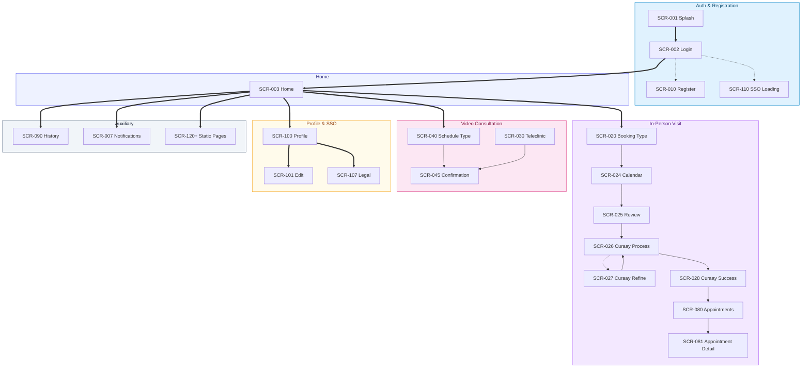

# IA (Info Map)

Canonical rules: `docs/artifacts/visual-artifacts-rules.md`

**Created:** 2026-01-21
**Last Updated:** 2026-01-22
**Source of Truth:** `client/src/App.tsx` routes, plus in-page navigation via `useLocation()` and `<Link />`. Planned screens are labeled.
**Screen Count (v1):** 52 (49 implemented, 3 planned) — Excludes v2 scopes: Prescriptions (16), Pharmacy (3); excludes system errors: Not Found (1)

---

## Visual Maps

### App Map (Hierarchy)

```mermaid
graph TD
    App["📱 App<br/>(Mobile)"]
    Auth["🔵 Auth Domain<br/>(14 screens)"]
    Home["🟣 Home<br/>SCR-003"]
    InPerson["🟪 In-Person Visit<br/>(13 screens)"]
    Video["🌸 Video Consultation<br/>(9 screens)"]
    History["⚪ History<br/>SCR-090"]
    Notif["⚪ Notifications<br/>(2 screens)"]
    Profile["🟠 Profile<br/>(8 screens)"]
    Static["⚪ Static Pages<br/>(FAQ, Privacy, Legal, Support)"]

    App --> Auth
    Auth --> Home
    Home --> InPerson
    Home --> Video
    Home --> History
    Home --> Notif
    Home --> Profile
    Profile --> Static

    classDef auth fill:#E0F2FE,stroke:#0284C7,color:#0C4A6E
    classDef hub fill:#EEF2FF,stroke:#6366F1,color:#312E81
    classDef inperson fill:#F3E8FF,stroke:#A855F7,color:#581C87
    classDef video fill:#FCE7F3,stroke:#DB2777,color:#831843
    classDef profile fill:#FFFBEB,stroke:#F59E0B,color:#92400E
    classDef system fill:#F1F5F9,stroke:#64748B,color:#0F172A

    class App system
    class Auth auth
    class Home hub
    class InPerson inperson
    class Video video
    class Profile profile
    class History,Notif,Static system
```

**v1 Structure**
- 🔵 **Auth Domain**: Splash, Login, Register, SSO, Password Reset (14 screens: 11 implemented, 3 planned)
- 🟣 **Home**: Central entry point to all features (1 screen)
  - 🟪 **In-Person Visit**: Booking, Curaay (processing/refinement/success), Appointments, Teleclinic (13 screens)
  - 🌸 **Video Consultation**: Telehealth (9 screens)
  - ⚪ **Notifications**: Alerts & updates (2 screens)
  - ⚪ **History**: Past appointments & activity (1 screen)
  - 🟠 **Profile**: User settings & account (8 screens)
    - ⚪ **Static Pages**: FAQ, Privacy, Legal, Support (4 screens)

**Total: 52 screens (49 implemented, 3 planned)**

**Out of v1 Scope (v2+ roadmap):**
- Prescriptions (RX) - 16 screens
- Pharmacy - 3 screens
- Total v2 deferred: 19 screens

Detailed flows: see `docs/artifacts/userflows/FLOWS.md`.

---

### Navigation Map (Behavioral)

## Screen Index (SCR-### ↔ Node ID ↔ Route)

| Screen ID | Node ID | Route(s) | Screen |
| --- | --- | --- | --- |
| SCR-001 | auth-splash | `/` | Splash |
| SCR-002 | auth-login | `/login` | Login |
| SCR-003 | hub-home | `/home` | Home |
| SCR-004 | auth-forgot-password | `/forgot-password` | Forgot Password (planned) |
| SCR-005 | auth-reset-password | `/reset-password` | Reset Password (planned) |
| SCR-006 | auth-reset-password-success | `/reset-password/success` | Reset Password Success (planned) |
| SCR-007 | notifications-list | `/notifications` | Notifications |
| SCR-008 | notifications-detail | `/notifications/:id` | Notification Detail |
| SCR-010 | reg-account | `/register` | Register. Account |
| SCR-011 | reg-verify-email | `/register/verify` | Register. Verify Email |
| SCR-012 | reg-personal-info | `/register/personal` | Register. Personal Info |
| SCR-013 | reg-insurance-type | `/register/insurance` | Register. Insurance Type |
| SCR-014 | reg-gkv-details | `/register/gkv-details` | Register. GKV Details |
| SCR-015 | reg-pkv-details | `/register/pkv-details` | Register. PKV Details |
| SCR-016 | reg-complete | `/register/complete` | Register. Complete |
| SCR-020 | booking-type | `/booking`, `/booking/type` | Booking. Type |
| SCR-021 | booking-specialty | `/booking/specialty` | Booking. Specialty Select |
| SCR-022 | booking-location | `/booking/location` | Booking. Location Select |
| SCR-023 | booking-doctors | `/booking/doctors` | Booking. Doctor Select |
| SCR-024 | booking-calendar | `/booking/calendar` | Booking. Calendar |
| SCR-025 | booking-review | `/booking/review` | Booking. Review |
| SCR-026 | booking-curaay-processing | `/booking/curaay-processing` | Booking. Curaay Processing |
| SCR-027 | booking-curaay-refinement | `/booking/curaay-refinement` | Booking. Curaay Refinement |
| SCR-028 | booking-curaay-success | `/booking/curaay-success` | Booking. Curaay Success |
| SCR-029 | booking-success | `/booking/success` | Booking. Success (unused in-app) |
| SCR-030 | teleclinic-simulated | `/teleclinic/simulated` | Teleclinic. Simulated |
| SCR-040 | telehealth-schedule-type | `/telehealth/schedule-type` | Telehealth. Schedule Type |
| SCR-041 | telehealth-symptoms-intro | `/telehealth/symptoms-intro` | Telehealth. Symptoms Intro |
| SCR-042 | telehealth-symptoms-details | `/telehealth/symptoms-details` | Telehealth. Symptoms Details |
| SCR-043 | telehealth-symptoms-info | `/telehealth/symptoms-info` | Telehealth. Symptoms Info |
| SCR-044 | telehealth-review | `/telehealth/review` | Telehealth. Review |
| SCR-045 | telehealth-confirmation | `/telehealth/confirmation` | Telehealth. Confirmation |
| SCR-046 | telehealth-waiting-room | `/telehealth/waiting-room` | Telehealth. Waiting Room |
| SCR-047 | telehealth-call | `/telehealth/call` | Telehealth. Call |
| SCR-048 | telehealth-summary | `/telehealth/summary` | Telehealth. Summary |
| SCR-080 | appt-list | `/appointments` | Appointments |
| SCR-081 | appt-detail | `/appointments/detail` | Appointment Detail |
| SCR-090 | history | `/history` | History |
| SCR-100 | profile | `/profile` | Profile |
| SCR-101 | profile-edit | `/profile/edit` | Profile. Edit |
| SCR-102 | profile-linked-accounts | `/profile/linked-accounts` | Profile. Linked Accounts |
| SCR-103 | profile-insurance-gkv | `/profile/insurance-gkv` | Profile. Insurance (GKV) |
| SCR-104 | profile-insurance-pkv | `/profile/insurance-pkv` | Profile. Insurance (PKV) |
| SCR-105 | profile-language | `/profile/language` | Profile. Language |
| SCR-106 | profile-support | `/profile/support` | Profile. Help and Support |
| SCR-107 | profile-privacy-legal | `/profile/legal` | Profile. Privacy and Legal |
| SCR-110 | sso-loading | `/sso/loading` | SSO. Loading |
| SCR-111 | sso-complete-profile | `/sso/complete-profile` | SSO. Complete Profile |
| SCR-120 | static-faq | `/static/faq` | Static. FAQ |
| SCR-121 | static-support | `/static/support` | Static. Support |
| SCR-122 | static-privacy | `/static/privacy` | Static. Privacy Policy |
| SCR-123 | static-legal | `/static/legal` | Static. Legal Disclosure |
