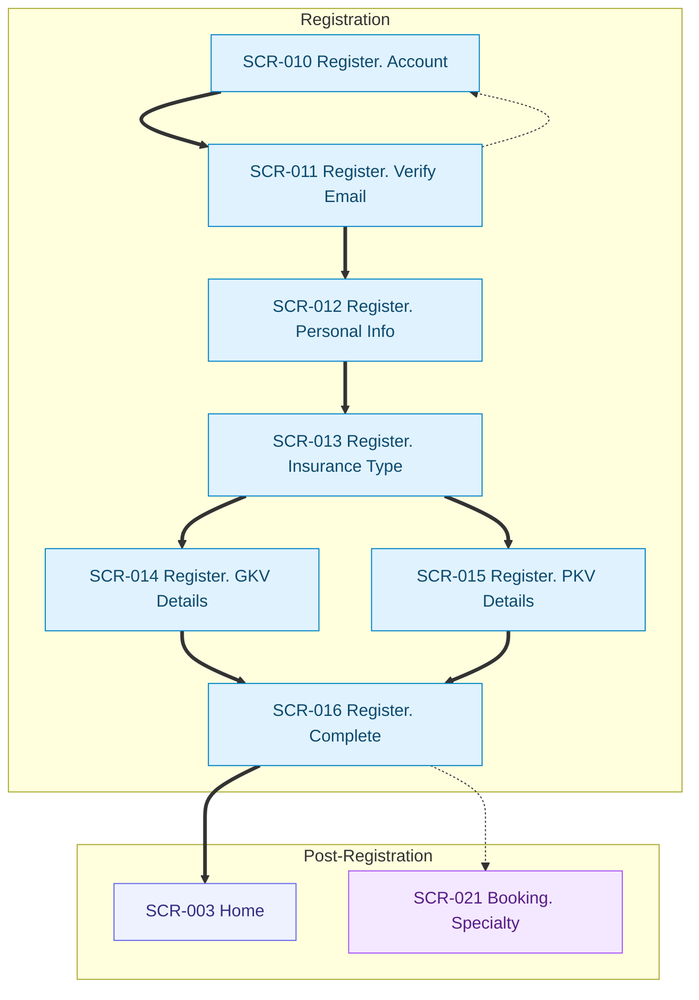
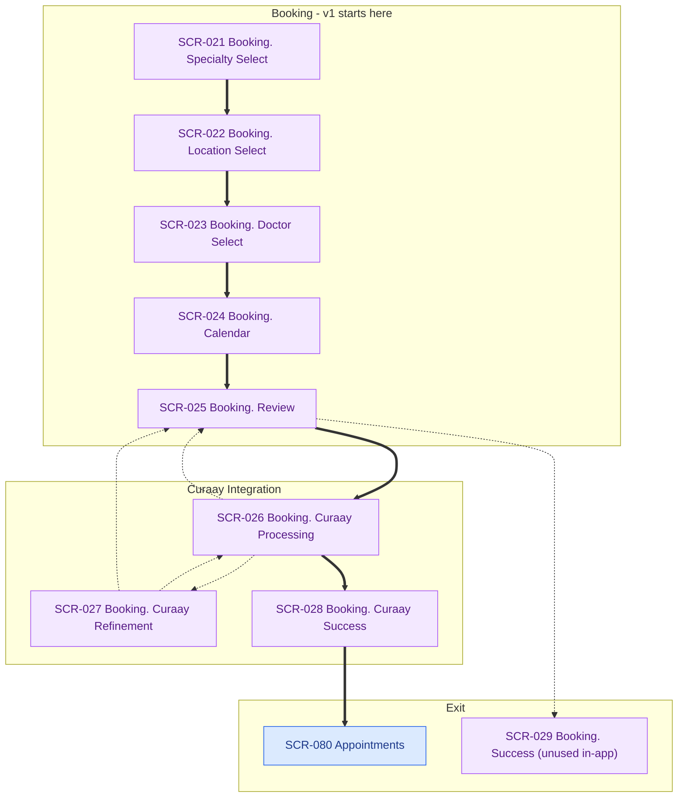
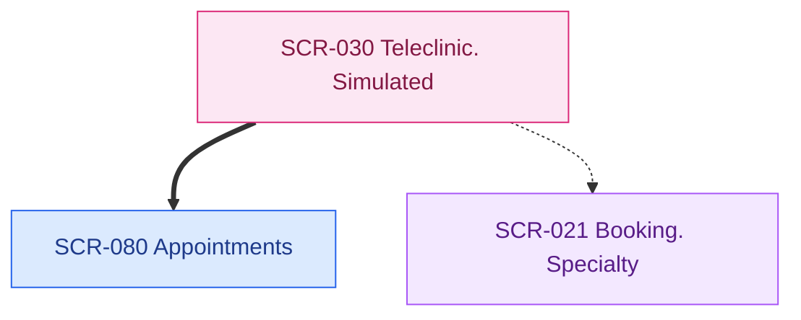
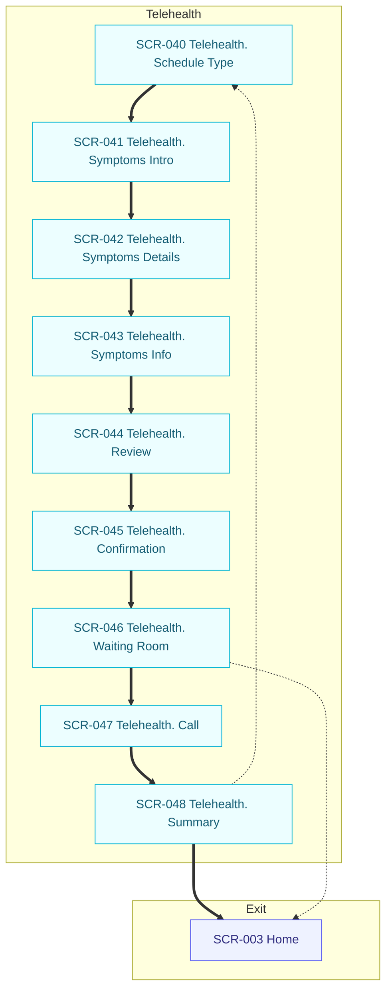

# FLOWS

Canonical rules: `docs/artifacts/visual-artifacts-rules.md`

**Created:** 2026-01-21
**Last Updated:** 2026-01-22 (video consultation hidden for v1)  
**Source of Truth:** `client/src/App.tsx` routes, plus in-page navigation via `useLocation()` and `<Link />`  

Exception: this is Mermaid navigation flows for the client app. Not D2 user flows.

Primary IA map: `docs/artifacts/ia-map/IA.md`.

## Registration Flow

## Booking Flow (In-Person)

**Note:** Type selection (SCR-020) is skipped in v1. Users go directly to specialty selection with `type: 'in-person'` pre-set.

---

## v2+ Roadmap (Hidden for v1)

### Video Consultation Flows (Hidden via `videoConsultationEnabled: false`)

**Booking Type Selection** (SCR-020) - Skipped in v1, only in-person available
**Teleclinic Flow** (SCR-030) - Video partner integration
**Telehealth Flow** (SCR-040-048) - In-app video consultation

Teleclinic Flow (Video Partner)

Telehealth Flow (In-App)

### Other v2+ Features

- **Prescriptions Flow** (SCR-050-065) - In-app RX management with GKV/PKV paths (hidden via `prescriptionEnabled: false`)
- **Pharmacy Search Flow** (SCR-070-072) - Location search & pharmacy details
