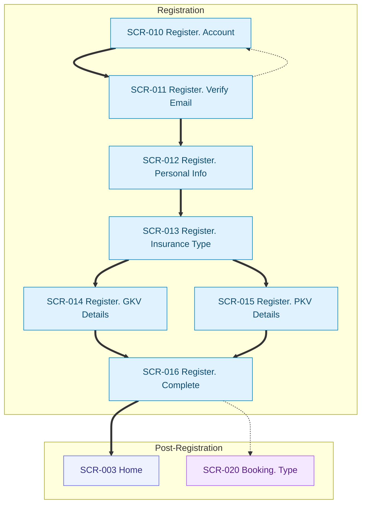
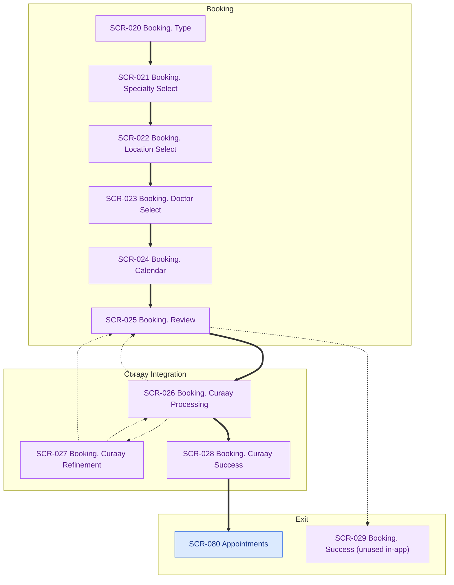
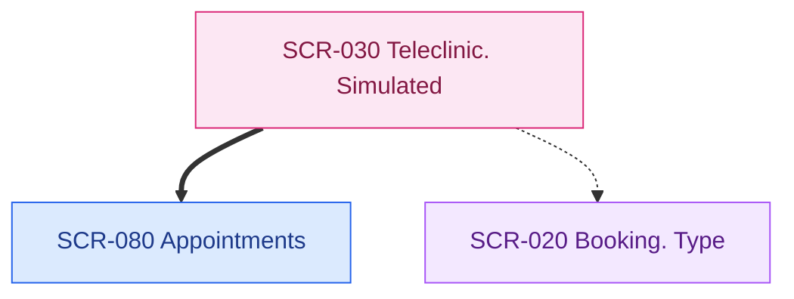
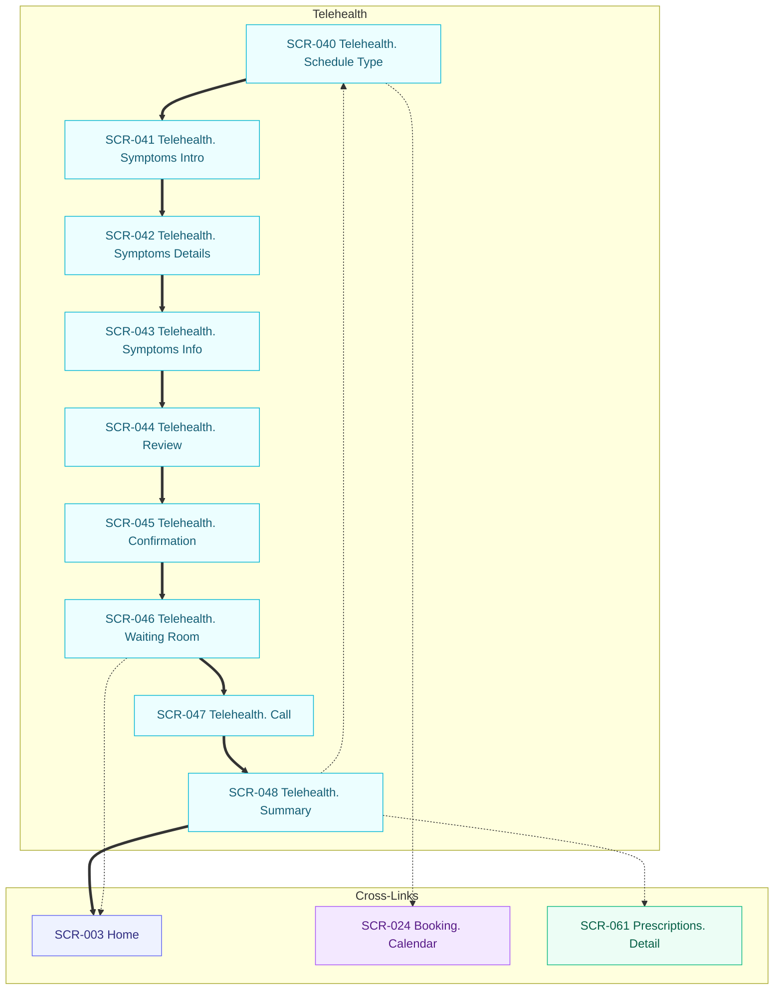
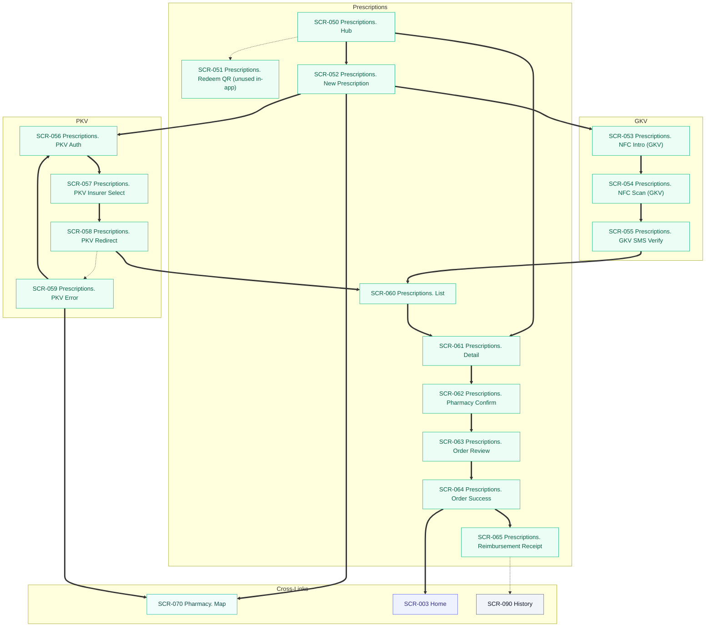
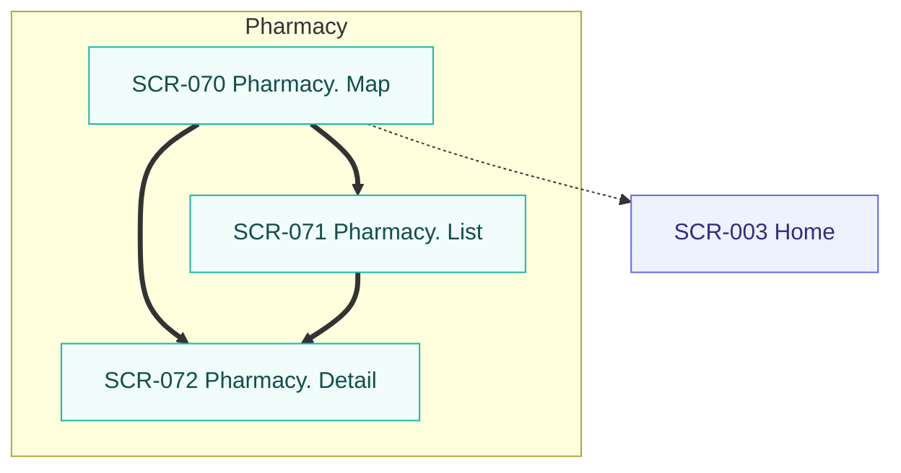

# IA-FLOWS (Mermaid. Exception)

Canonical rules: `docs/artifacts/visual-artifacts-rules.md`

**Created:** 2026-01-21  
**Last Updated:** 2026-01-21  
**Source of Truth:** `client/src/App.tsx` routes, plus in-page navigation via `useLocation()` and `<Link />`  

Exception: this is Mermaid navigation flows for the client app. Not D2 user flows.

Primary IA map: `docs/artifacts/ia-map/IA.md`.

## Registration Flow

## Booking Flow (In-Person)

## Teleclinic Flow (Video Partner)

## Telehealth Flow (In-App)

## Prescriptions Flow

## Pharmacy Search Flow

