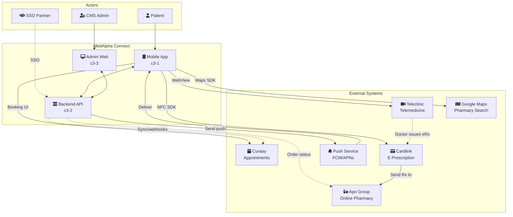

# MedAlpha Connect

## Goal

Enable patients to book medical appointments and redeem prescriptions through a unified mobile experience, while supporting white-label deployment for retail partners.

## Overview

## Actors

| ID | Actor | Description |
|----|-------|-------------|
| A1 | Patient | End user booking appointments and redeeming prescriptions via mobile app |
| A2 | CMS Admin | Internal staff managing dynamic content via admin panel |
| A3 | SSO Partner | Future retail partners transferring customers via SSO |

## Containers

| ID | Name | Type | Status | Goal Contribution |
|----|------|------|--------|-------------------|
| c3-1 | mobile-app | app | planned | Patient-facing cross-platform app (React Native) for appointments & prescriptions |
| c3-2 | backend-api | service | planned | Core business logic, external integrations, auth, and CMS data |
| c3-3 | admin-web | app | planned | Web interface for CMS admin to manage dynamic content |

## External Systems

| ID | System | Purpose | Connected From | Integration Type |
|----|--------|---------|----------------|------------------|
| E1 | Curaay | AI-driven doctor appointment booking | c3-1 (UI), c3-2 (sync) | Mobile: Booking UI, Backend: Webhooks/sync |
| E2 | Teleclinic | Telemedicine video consultations | c3-1 only | WebView/redirect (patient uses Teleclinic UI) |
| E3 | Apo Group | Online pharmacy for prescription redemption | E4, c3-2 | Receives Rx from Cardlink, Backend checks order status |
| E4 | Cardlink | E-prescription reading via NFC (eGK) | c3-1 only | Mobile NFC SDK (GEDISA/Akquinet) |
| E5 | Google Maps | Offline pharmacy location search | c3-1 only | Mobile Maps SDK |
| E6 | Push Service | Push notifications (FCM/APNs) | c3-2 → c3-1 | Backend sends, Mobile receives |

## Linkages

| From | To | Reason |
|------|-----|--------|
| A1 → c3-1 | Patient uses mobile app | Primary user interface for all features |
| A2 → c3-3 | Admin uses web panel | Content management separated from patient app |
| A3 → c3-2 | Partner SSO to backend | Authentication handled server-side for security |
| c3-1 → c3-2 | Mobile calls backend | See "Mobile ↔ Backend Data Flows" below |
| c3-3 ↔ c3-2 | Admin calls backend | CMS data managed via same API |
| c3-1 → E1 | Mobile to Curaay | Patient books appointments directly in app |
| c3-2 → E1 | Backend to Curaay | Sync appointment data, receive webhooks |
| c3-1 → E2 | Mobile to Teleclinic | WebView for telemedicine session |
| E2 → E4 | Teleclinic to Cardlink | Doctor issues e-prescription after consultation |
| c3-1 → E4 | Mobile to Cardlink | NFC SDK reads eGK to retrieve e-prescriptions |
| E4 → E3 | Cardlink to Apo Group | E-prescription sent to online pharmacy |
| c3-2 → E3 | Backend to Apo Group | Check order/delivery status |
| c3-1 → E5 | Mobile to Maps | Offline pharmacy search |
| c3-2 → E6 → c3-1 | Push flow | Backend triggers, Push service delivers to mobile |

## Mobile ↔ Backend Data Flows

| Domain | Direction | Data/Operations |
|--------|-----------|-----------------|
| **Auth** | c3-1 → c3-2 | Login, registration, social auth, token refresh |
| **Auth (SSO)** | c3-1 → c3-2 | Partner SSO handoff (future) |
| **User/Profile** | c3-1 ↔ c3-2 | CRUD profile, completion validation |
| **CMS** | c3-1 ← c3-2 | Fetch dynamic home content, offers, FAQ |
| **Appointments** | c3-1 ↔ c3-2 | Sync/store appointment data from Curaay |
| **Prescriptions** | c3-1 ↔ c3-2 | Track Rx redemption status, order updates |
| **History** | c3-1 ← c3-2 | Retrieve past appointments, prescriptions, telemedicine |
| **Push** | c3-1 ← c3-2 | Receive notifications (via FCM/APNs) |

## Key Constraints

1. **White-Label Ready**: Architecture must support multiple branded deployments from same codebase
2. **Profile-Gated Access**: Main features require completed user profile
3. **Legal Compliance**: Users must explicitly choose online/offline pharmacy (German regulation)
4. **SSO-Ready**: Authentication must support future partner SSO integration
