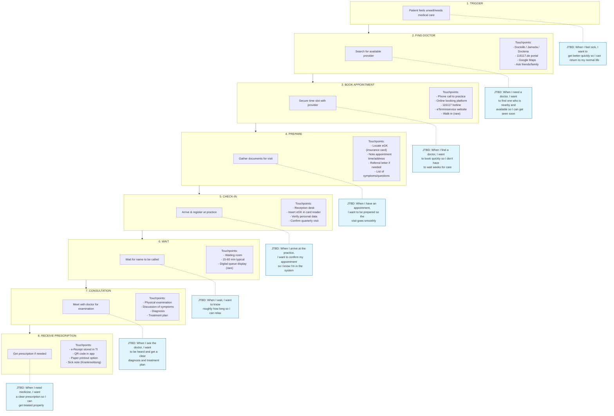
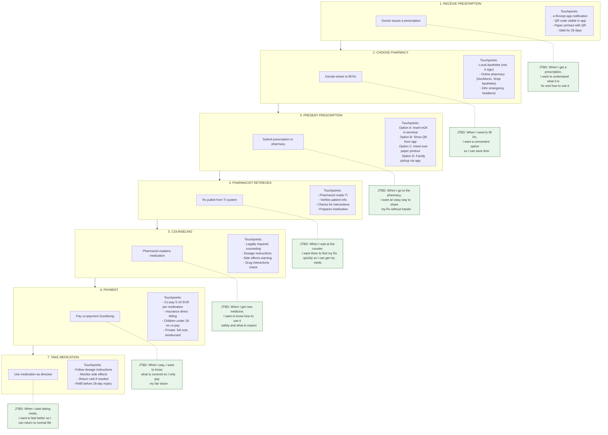
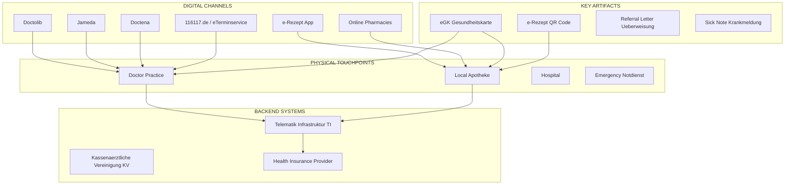

# German Healthcare Task Flows

## Combined Journey Overview

```mermaid
flowchart LR
    subgraph APPOINTMENT["JOURNEY 1: DOCTOR APPOINTMENT"]
        direction TB
        A1((Start)) --> A2[Feel Unwell]
        A2 --> A3[Find Doctor]
        A3 --> A4[Book Appointment]
        A4 --> A5[Prepare Documents]
        A5 --> A6[Check-in with eGK]
        A6 --> A7[Wait]
        A7 --> A8[Consultation]
        A8 --> A9{Prescription Needed?}
    end

    A9 -->|No| A10((End))
    A9 -->|Yes| B1

    subgraph PRESCRIPTION["JOURNEY 2: PRESCRIPTION REDEMPTION"]
        direction TB
        B1[Receive e-Rezept] --> B2[Choose Pharmacy]
        B2 --> B3[Present Rx]
        B3 --> B4[Pharmacist Retrieves]
        B4 --> B5[Counseling]
        B5 --> B6[Pay Co-pay]
        B6 --> B7[Take Medication]
        B7 --> B8((End))
    end

    style A1 fill:#fff3e0,stroke:#e65100
    style A10 fill:#fff3e0,stroke:#e65100
    style B8 fill:#fff3e0,stroke:#e65100
```

## Appointment Journey

```mermaid
flowchart TB
    subgraph TRIGGER["1. TRIGGER"]
        T1[Patient feels unwell/needs medical care]
    end

    subgraph FIND["2. FIND DOCTOR"]
        F1[Search for available provider]
        F2["Touchpoints:
        - Doctolib / Jameda / Doctena
        - 116117.de portal
        - Google Maps
        - Ask friends/family"]
    end

    subgraph BOOK["3. BOOK APPOINTMENT"]
        B1[Secure time slot with provider]
        B2["Touchpoints:
        - Phone call to practice
        - Online booking platform
        - 116117 hotline
        - eTerminservice website
        - Walk-in (rare)"]
    end

    subgraph PREPARE["4. PREPARE"]
        P1[Gather documents for visit]
        P2["Touchpoints:
        - Locate eGK (insurance card)
        - Note appointment time/address
        - Referral letter if needed
        - List of symptoms/questions"]
    end

    subgraph CHECKIN["5. CHECK-IN"]
        C1[Arrive & register at practice]
        C2["Touchpoints:
        - Reception desk
        - Insert eGK in card reader
        - Verify personal data
        - Confirm quarterly visit"]
    end

    subgraph WAIT["6. WAIT"]
        W1[Wait for name to be called]
        W2["Touchpoints:
        - Waiting room
        - 15-60 min typical
        - Digital queue display (rare)"]
    end

    subgraph CONSULT["7. CONSULTATION"]
        CO1[Meet with doctor for examination]
        CO2["Touchpoints:
        - Physical examination
        - Discussion of symptoms
        - Diagnosis
        - Treatment plan"]
    end

    subgraph RECEIVE["8. RECEIVE PRESCRIPTION"]
        R1[Get prescription if needed]
        R2["Touchpoints:
        - e-Rezept stored in TI
        - QR code in app
        - Paper printout option
        - Sick note (Krankmeldung)"]
    end

    TRIGGER --> FIND --> BOOK --> PREPARE --> CHECKIN --> WAIT --> CONSULT --> RECEIVE

    T1 -.- JTBD1["JTBD: When I feel sick, I want to
    get better quickly so I can
    return to my normal life"]

    F1 -.- JTBD2["JTBD: When I need a doctor, I want
    to find one who is nearby and
    available so I can get seen soon"]

    B1 -.- JTBD3["JTBD: When I find a doctor, I want
    to book quickly so I don't have
    to wait weeks for care"]

    P1 -.- JTBD4["JTBD: When I have an appointment,
    I want to be prepared so the
    visit goes smoothly"]

    C1 -.- JTBD5["JTBD: When I arrive at the practice,
    I want to confirm my appointment
    so I know I'm in the system"]

    W1 -.- JTBD6["JTBD: When I wait, I want to know
    roughly how long so I can relax"]

    CO1 -.- JTBD7["JTBD: When I see the doctor, I want
    to be heard and get a clear
    diagnosis and treatment plan"]

    R1 -.- JTBD8["JTBD: When I need medicine, I want
    a clear prescription so I can
    get treated properly"]

    style JTBD1 fill:#e1f5fe,stroke:#01579b
    style JTBD2 fill:#e1f5fe,stroke:#01579b
    style JTBD3 fill:#e1f5fe,stroke:#01579b
    style JTBD4 fill:#e1f5fe,stroke:#01579b
    style JTBD5 fill:#e1f5fe,stroke:#01579b
    style JTBD6 fill:#e1f5fe,stroke:#01579b
    style JTBD7 fill:#e1f5fe,stroke:#01579b
    style JTBD8 fill:#e1f5fe,stroke:#01579b
```

## Prescription Redemption Journey

```mermaid
flowchart TB
    subgraph RX["1. RECEIVE PRESCRIPTION"]
        RX1[Doctor issues e-prescription]
        RX2["Touchpoints:
        - e-Rezept app notification
        - QR code visible in app
        - Paper printout with QR
        - Valid for 28 days"]
    end

    subgraph CHOOSE["2. CHOOSE PHARMACY"]
        CH1[Decide where to fill Rx]
        CH2["Touchpoints:
        - Local Apotheke (red A sign)
        - Online pharmacy (DocMorris, Shop Apotheke)
        - 24hr emergency Notdienst"]
    end

    subgraph PRESENT["3. PRESENT PRESCRIPTION"]
        PR1[Submit prescription to pharmacy]
        PR2["Touchpoints:
        Option A: Insert eGK in terminal
        Option B: Show QR from app
        Option C: Hand over paper printout
        Option D: Family pickup via app"]
    end

    subgraph RETRIEVE["4. PHARMACIST RETRIEVES"]
        RE1[Rx pulled from TI system]
        RE2["Touchpoints:
        - Pharmacist reads TI
        - Verifies patient info
        - Checks for interactions
        - Prepares medication"]
    end

    subgraph COUNSEL["5. COUNSELING"]
        CL1[Pharmacist explains medication]
        CL2["Touchpoints:
        - Legally required counseling
        - Dosage instructions
        - Side effects warning
        - Drug interactions check"]
    end

    subgraph PAY["6. PAYMENT"]
        PA1[Pay co-payment Zuzahlung]
        PA2["Touchpoints:
        - Co-pay 5-10 EUR per medication
        - Insurance direct billing
        - Children under 18: no co-pay
        - Private: full cost, reimbursed"]
    end

    subgraph TAKE["7. TAKE MEDICATION"]
        TA1[Use medication as directed]
        TA2["Touchpoints:
        - Follow dosage instructions
        - Monitor side effects
        - Return visit if needed
        - Refill before 28-day expiry"]
    end

    RX --> CHOOSE --> PRESENT --> RETRIEVE --> COUNSEL --> PAY --> TAKE

    RX1 -.- JTBD_RX["JTBD: When I get a prescription,
    I want to understand what it is
    for and how to use it"]

    CH1 -.- JTBD_CH["JTBD: When I need to fill Rx,
    I want a convenient option
    so I can save time"]

    PR1 -.- JTBD_PR["JTBD: When I go to the pharmacy,
    I want an easy way to share
    my Rx without hassle"]

    RE1 -.- JTBD_RE["JTBD: When I wait at the counter,
    I want them to find my Rx
    quickly so I can get my meds"]

    CL1 -.- JTBD_CL["JTBD: When I get new medicine,
    I want to know how to use it
    safely and what to expect"]

    PA1 -.- JTBD_PA["JTBD: When I pay, I want to know
    what is covered so I only pay
    my fair share"]

    TA1 -.- JTBD_TA["JTBD: When I start taking meds,
    I want to feel better so I
    can return to normal life"]

    style JTBD_RX fill:#e8f5e9,stroke:#1b5e20
    style JTBD_CH fill:#e8f5e9,stroke:#1b5e20
    style JTBD_PR fill:#e8f5e9,stroke:#1b5e20
    style JTBD_RE fill:#e8f5e9,stroke:#1b5e20
    style JTBD_CL fill:#e8f5e9,stroke:#1b5e20
    style JTBD_PA fill:#e8f5e9,stroke:#1b5e20
    style JTBD_TA fill:#e8f5e9,stroke:#1b5e20
```

## Healthcare Systems Overview

```mermaid
flowchart TB
    subgraph DIGITAL["DIGITAL CHANNELS"]
        D1[Doctolib]
        D2[Jameda]
        D3[Doctena]
        D4[116117.de / eTerminservice]
        D5[e-Rezept App]
        D6[Online Pharmacies]
    end

    subgraph PHYSICAL["PHYSICAL TOUCHPOINTS"]
        P1[Doctor Practice]
        P2[Local Apotheke]
        P3[Hospital]
        P4[Emergency Notdienst]
    end

    subgraph INFRASTRUCTURE["BACKEND SYSTEMS"]
        I1[Telematik Infrastruktur TI]
        I2[Kassenaerztliche Vereinigung KV]
        I3[Health Insurance Provider]
    end

    subgraph ARTIFACTS["KEY ARTIFACTS"]
        A1[eGK Gesundheitskarte]
        A2[e-Rezept QR Code]
        A3[Referral Letter Ueberweisung]
        A4[Sick Note Krankmeldung]
    end

    D1 & D2 & D3 & D4 --> P1
    D5 --> P2
    D6 --> P2
    P1 --> I1
    P2 --> I1
    I1 --> I3
    A1 --> P1 & P2
    A2 --> P2
```
