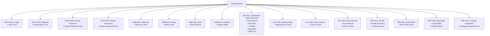

# Sitemap template

```mermaid
    graph TD
        Root[CalorieTracker]

        %% Authentication
        Root --> AUTH001["AUTH-001 | Login<br>• Login Form"]
        Root --> AUTH002["AUTH-002 | Register<br>• Registration Form"]
        Root --> AUTH003["AUTH-003 | Forgot Password<br>• Forgot Password Form"]
        Root --> AUTH004["AUTH-004 | Reset Password<br>• Reset Password Form"]

        %% Onboarding
        Root --> ONB001["ONB-001 | Welcome<br>• Welcome Hero"]
        Root --> ONB002["ONB-002 | Name<br>• Name Input"]
        Root --> ONB003["ONB-003 | Goal<br>• Goal Selector"]
        Root --> ONB004["ONB-004 | Calories<br>• Calorie Slider"]

        %% Core App
        Root --> CAL001["CAL-001 | Dashboard<br>• Daily Summary<br>• Food Search<br>• Favorites<br>• Timeline<br>• Templates<br>• Meal List"]
        Root --> CAL002["CAL-002 | Manual Entry<br>• Manual Entry Form"]
        Root --> CAL003["CAL-003 | Scan Camera<br>• Camera View"]
        Root --> CAL004["CAL-004 | Scan Results<br>• Scan Results<br>• Portion Picker"]

        %% Profile
        Root --> PRF001["PRF-001 | Profile<br>• Profile Summary<br>• Profile Actions"]
        Root --> PRF002["PRF-002 | Edit Profile<br>• Edit Profile Form"]
        Root --> PRF003["PRF-003 | Edit Goals<br>• Goal Editor<br>• Calorie Editor"]
        Root --> PRF004["PRF-004 | Change Password<br>• Change Password Form"]
```
